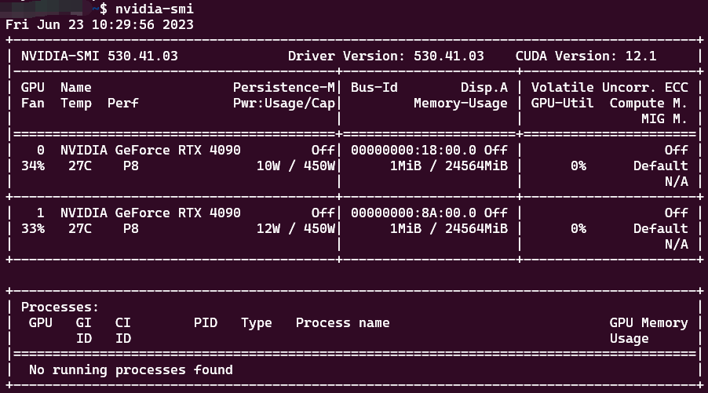
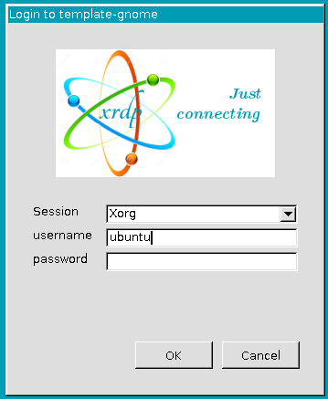

[[toc]]

## 前言

本文的受众为实验室的公用GPU服务器管理员，需要有一定的Linux基础，或者对此感兴趣的普通用户。

如果您并不关心为何这样配置服务器环境，以及对如何部署、管理这样一台服务器不感兴趣，可以选择跳过这些内容，前往[用户指南](./#用户指南)。

事情的起因是实验室购入了一台公用GPU服务器，考虑到每个人所需的软件和环境差异巨大，因此，需要一种方案来满足多用户对服务器的使用的需求。

这里列出一些期望达到的目标：

- 不同用户之间不能相互影响
- 用户要能便捷地访问服务器
- 用户的操作不能影响到宿主机的稳定运行
- 用户应当可以自由地访问外部网络
- 用户应当可以使用GPU，不同用户可以共享GPU
- 用户应当可以自由地配置程序运行环境
- 管理员应该能轻松地管理用户

**注意：** *本次部署属于科研基础架构的部署，属于各种软件的工程实现和部署，本身并不具备科研价值，同样也无法基于该方法搭建的服务器实验运行结果、实验数据产出做出任何保障。*

## 架构选择

从最初的需求出发，我们想要不同用户之间不能相互影响，也就是在用户级别进行隔离，主流的隔离方案包括Docker（容器化）、LXC（Linux容器）、OpenVZ（虚拟机）。

首先是容器方案，以Docker为例。考虑到开销问题，Ubuntu in Docker 首先被排除备选。Docker有成熟的[NVIDIA-Docker](https://docs.nvidia.com/datacenter/cloud-native/container-toolkit/latest/install-guide.html#container-runtimes)支持，可以允许不同容器之间共享GPU，Docker成熟的网络接口也使容器的可访问性得到了保障，同时可以使用Linux内核的[cgroups](https://manpages.ubuntu.com/manpages/focal/en/man7/cgroups.7.html)灵活分配硬件资源，是一个不错的备选方案。

OpenVZ、KVM、Xen等虚拟机方案在资源利用上不够轻量，管理上相较Docker也复杂很多，同样基于开销问题将其排除备选。

LXC可以理解为内核级的容器，允许不同容器之间共享GPU，相比Docker更加轻量，也可以更方便地使用系统资源。

Docker的隔离更偏向于运行环境的隔离，将应用和全部依赖环境全部打包到一个单一对象中，可以在不包含完整的操作系统的情况下运行应用，而LXC基于namespaces进行隔离，可以用**更低的开销**提供灵活的系统环境，支持用户在系统层面肆意整活，这给了我充足的理由选择LXC。**甚至**用户可以在LXC容器中再套娃一个Docker，既然如此，也没什么好纠结的了。

> **什么？你问LXD？**

> 那只是我用原生LXC觉得太麻烦，并且解决了LXC支持跨主机容器迁移不完全、容器管理复杂等问题的备胎，不提也罢（×）。
> by yuany3721


<br/>
<details> 
    <summary>如果您对LXC与LXD的区别感兴趣，您可以展开这里了解一些信息</summary>
    <p>就在本次部署的两周前，LXD于2023年6月4日正式移交给Canonical，<a href="https://linuxcontainers.org/lxd/#project-announcement">公告</a>中展示了这一动作的具体变化。</p>
    <p>就使用体验而言，LXD无疑是远超LXC的，尽管它们似乎（可能就是）用的同一种实现方式和内核。</p>
    <p>以下是一些功能在使用上的区别，也正是复杂性的问题，使我放弃了直接使用LXC的想法，转而由LXD实现本次部署。</p>
    <table>
        <tr><th>功能</th><th>LXC</th><th>LXD</th></tr>
        <tr><td>新建容器</td><td><code>lxc-create -t download -n template -- \ <br/>
                --dist ubuntu --release jammy --arch amd64</code></td><td><code>lxc launch tuna-images:ubuntu/jammy template</code></td></tr>
        <tr><td>启动容器</td><td><code>lxc-start -n template</code></td><td><code>lxc start template</code></td></tr>
        <tr><td>向容器中注入命令</td><td><code>lxc-attach -n template -- apt update</code></td><td><code>lxc exec template -- apt update</code></td></tr>
        <tr><td>修改容器配置</td><td><code>vi path/to/lxc/template/config</code></td><td><code>lxc config edit template</code></td></tr>
        <tr><td>挂载GPU</td><td><code>for x in $(ls /dev/nvidia*); do<br/>
                echo lxc.mount.entry = $x $(echo $x | cut -b 2-) none bind,optional,create=file >> path/to/lxc/template/config<br/>
                done</code></td><td><code>lxc config device add template gpu gpu</code></td></tr>
    </table>
    <p>上述举例如果不能使您窥见一斑，您可以尝试参照<a href="https://linuxcontainers.org/lxc/manpages/">LXC文档</a>、<a href="https://documentation.ubuntu.com/lxd/en/latest/">LXD文档</a>进行尝试。</p>
</details>
<br/>

## 环境说明及前置工作

### **环境说明**

本次的物理机硬件环境如下：

```
CPU: Intel(R) Xeon(R) Platinum 8336C CPU
RAM: Samsung DDR4 SingleBitECC 3200 MT/s * 4
GPU: NVIDIA GeForce RTX 4090 * 2
Disk: Samsung SSD 980 1TB + WUH721816AL 14TB
```

宿主机所在网络环境如下：

```
gateway: 172.16.60.1/23
mask: 255.255.254.0
```

### **前置工作**

1. 安装Ubuntu Server

选择Ubuntu Server 22.04.2作为宿主机的系统，使用rufus制作系统启动盘后插入服务器，使用SuperMicroIPMIView扫描IPMI端口，连接IPMI服务安装系统，细节省略。

*这里其实可以通过网络安装ubuntu，但是没有折腾，mark一下以后有机会进行尝试*

2. 配置系统环境

参考[Ubuntu Server基本环境配置](../note/linux/2023-06-20.md)

- 配置系统联网超时

- 配置swap分区

- 配置数据盘挂载

    将`WUH721816AL 14TB`格式化为`/dev/sda1`，并挂载在`/data`目录

    设置data目录权限：

    ```bash
    $ sudo chmod 755 /data
    $ sudo chmod +t /data
    ```

- 配置OpenSSH（可选）

    允许密码登录、修改服务端口为33

- 配置防火墙

    参考[ufw防火墙配置](../note/linux/2021-09-28.md)

    ```bash
    $ sudo ufw allow 33/tcp
    $ sudo ufw enable
    $ sudo ufw reload
    ```

3. 配置网桥

在类似我们的方案中，[为实验室建立公用GPU服务器](https://abcdabcd987.com/setup-shared-gpu-server-for-labs/)、[实验室GPU服务器的LXD虚拟化](https://github.com/shenuiuin/LXD_GPU_SERVER)等实操中（不知道为什么）采用了基于iptables、端口映射的技术实现绕过宿主机访问容器。

**但是！这一点也不优雅！** 服务器就在内网，又不缺IPv4地址，为何要加上端口号访问呢？因此，我在宿主机中建立了一个网桥，lxc容器通过网桥直接从网关DHCP获取IP。

在Ubuntu22.04中，系统默认使用netplan配置网络。我们直接以修改netplan配置的方式新建一个网桥：

```bash
$ cd /etc/netplan

# 备份默认配置
$ sudo cp 00-installer-config.yaml 00-eno1-br0-bridge.yaml
$ sudo mv 00-installer-config.yaml 00-installer-config.yaml.bak

$ sudo vi 00-eno1-br0-bridge.yaml

network:
  renderer: networkd
  ethernets:
    eno1:
    # 固定IP
      dhcp4: no
  bridges:
    br0:
      interfaces: [eno1]
      # 这是修改网桥之前eno1网卡获取到的ip，保持一致可以避免一些麻烦
      addresses: [172.16.61.82/23]
      routes:
        # 配置默认网关，gateway4已经被标记为deprecated不建议使用
        - to: default
          via: 172.16.60.1
          # 加上权重，不进行配置的话产生冲突，使用route命令查看路由表会看到eno1和br0两条default路由，导致无法联网
          metric: 100
      nameservers:
        addresses:
        # DNS服务器，edit as you like
          - 114.114.114.114
          - 8.8.8.8
          - 8.8.4.4
  version: 2

# 应用网络
$ sudo netplan try
```

检查网络配置，`ip a`类似这样：

> 2: eno1: <BROADCAST,MULTICAST,UP,LOWER_UP> mtu 1500 qdisc mq master br0 state UP group default qlen 1000\
>     link/ether 3c:ec:ef:cc:60:28 brd ff:ff:ff:ff:ff:ff\
>     altname enp6s0\
> 5: br0: <BROADCAST,MULTICAST,UP,LOWER_UP> mtu 1500 qdisc noqueue state UP group default qlen 1000\
>     link/ether d6:87:d1:44:19:7c brd ff:ff:ff:ff:ff:ff\
>     inet 172.16.61.82/23 brd 172.16.61.255 scope global br0\
>        valid_lft forever preferred_lft forever\
>     inet6 fe80::d487:d1ff:fe44:197c/64 scope link\
>        valid_lft forever preferred_lft forever

`route`类似这样：

> Kernel IP routing table\
> Destination&nbsp;&nbsp;&nbsp;&nbsp;&nbsp;Gateway&nbsp;&nbsp;&nbsp;&nbsp;&nbsp;&nbsp;&nbsp;&nbsp;&nbsp;Genmask&nbsp;&nbsp;&nbsp;&nbsp;&nbsp;&nbsp;&nbsp;&nbsp;&nbsp;Flags&nbsp;Metric&nbsp;Ref&nbsp;&nbsp;&nbsp;&nbsp;Use&nbsp;Iface\
> default&nbsp;&nbsp;&nbsp;&nbsp;&nbsp;&nbsp;&nbsp;&nbsp;&nbsp;&nbsp;&nbsp;&nbsp;_gateway&nbsp;&nbsp;&nbsp;&nbsp;&nbsp;&nbsp;&nbsp;&nbsp;0.0.0.0&nbsp;&nbsp;&nbsp;&nbsp;&nbsp;&nbsp;&nbsp;&nbsp;&nbsp;&nbsp;&nbsp;&nbsp;&nbsp;&nbsp;UG&nbsp;&nbsp;&nbsp;&nbsp;100&nbsp;&nbsp;&nbsp;&nbsp;&nbsp;0&nbsp;&nbsp;&nbsp;&nbsp;&nbsp;&nbsp;&nbsp;&nbsp;0&nbsp;&nbsp;&nbsp;&nbsp;&nbsp;br0\
> 172.16.60.0&nbsp;&nbsp;&nbsp;&nbsp;&nbsp;0.0.0.0&nbsp;&nbsp;&nbsp;&nbsp;&nbsp;&nbsp;&nbsp;&nbsp;&nbsp;&nbsp;&nbsp;&nbsp;255.255.254.0&nbsp;&nbsp;&nbsp;U&nbsp;&nbsp;&nbsp;&nbsp;&nbsp;&nbsp;&nbsp;0&nbsp;&nbsp;&nbsp;&nbsp;&nbsp;&nbsp;&nbsp;&nbsp;0&nbsp;&nbsp;&nbsp;&nbsp;&nbsp;&nbsp;&nbsp;&nbsp;0&nbsp;&nbsp;&nbsp;&nbsp;&nbsp;br0


## 配置LXD-GPU环境

### **配置运行环境**

1. 安装LXC、LXD

这里的LXD使用`5.0/stable`版本，请使用前先查阅[LXD官方安装指引](https://documentation.ubuntu.com/lxd/en/latest/installing/#how-to-install-lxd)修改安装版本号。

```bash
$ sudo apt update
$ sudo apt install lxc
$ sudo snap instll lxd --channel=5.0/stable
```

如果需要的话，可能有必要进行[apt换源](../note/linux/2023-01-10.md)

由于snap只有server outside the Great Firewall，所以提示`Unable to contact snap store`的时候，可能需要一点点科学上网手段，以下是临时设置snap代理的方法：

```bash
$ sudo snap set system proxy.http="your proxy url"
$ sudo snap set system proxy.https="your proxy url"
```

2. 检查lxc的依赖

使用`lxc-checkconfig`检查lxc容器的必要组件。具体到本次配置，该命令显示系统存在以下问题：

```
Cgroup v1 systemd controller: missing
Cgroup v1 freezer controller: missing
Cgroup ns_cgroup: required
```

在Ubuntu22.04中，默认情况下不会启用cgroup v1 systemd controller和ns_cgroup。编辑`/etc/default/grub`：

```
GRUB_CMDLINE_LINUX="cgroup_enable=memory systemd.unified_cgroup_hierarchy=0 cgroup_namespace.enable=1"
```

保存并退出后，更新GRUB配置并重新启动系统以应用修改。

```bash
$ sudo update-grub
$ sudo reboot
```

3. 配置防火墙以适应网桥

在Ubuntu22.04（大概率以及未来的版本）中，ufw改变了它的默认规则，需要修改网桥的route属性，否则会导致lxc容器无法从外部网关获取IP，即使正确地配置了daemon、dhcp等所有服务。参考[Ubuntu 22.04 LXD networking issue, not getting IPs, and solution](https://discuss.linuxcontainers.org/t/ubuntu-22-04-lxd-networking-issue-not-getting-ips-and-solution-please-verify-correctness/14739)

```bash
$ sudo ufw allow out on br0
$ sudo ufw route allow out on br0
```

### **配置基础镜像**

*注：以下配置过程中，`$`开头表示命令在宿主机中运行，`root@template:~#`开头表示命令在template容器中以root身份（exec进去的）运行。*

1. 初始化LXD环境

```bash
$ lxd init
```

以下是我的配置选项，仅供参考：

```
Would you like to use LXD clustering? (yes/no) [default=no]: no
Do you want to configure a new storage pool? (yes/no) [default=yes]:
Name of the new storage pool [default=default]: lxd-pool
Name of the storage backend to use (cephobject, dir, lvm, zfs, btrfs, ceph) [default=zfs]:
Create a new ZFS pool? (yes/no) [default=yes]:
Would you like to use an existing empty block device (e.g. a disk or partition)? (yes/no) [default=no]:
Size in GiB of the new loop device (1GiB minimum) [default=30GiB]: 50GiB
Would you like to connect to a MAAS server? (yes/no) [default=no]:
Would you like to create a new local network bridge? (yes/no) [default=yes]: no
Would you like to configure LXD to use an existing bridge or host interface? (yes/no) [default=no]: yes
Name of the existing bridge or host interface: br0
Would you like the LXD server to be available over the network? (yes/no) [default=no]:
Would you like stale cached images to be updated automatically? (yes/no) [default=yes]:
Would you like a YAML "lxd init" preseed to be printed? (yes/no) [default=no]: yes
config: {}
networks: []
storage_pools:
- config:
    size: 50GiB
  description: ""
  name: lxd-pool
  driver: zfs
profiles:
- config: {}
  description: ""
  devices:
    eth0:
      name: eth0
      nictype: bridged
      parent: br0
      type: nic
    root:
      path: /
      pool: lxd-pool
      type: disk
  name: default
projects: []
cluster: null
```

修改默认配置文件，限制默认存储大小，避免一个容器占满硬盘

```bash
$ lxc profile edit default
config: {}
description: Default LXD profile
devices:
  eth0:
    name: eth0
    nictype: bridged
    parent: br0
    type: nic
  root:
    path: /
    pool: lxd-pool
    size: 50GB
    type: disk
name: default
used_by: []
```

2. 创建基础容器模板

添加清华LXC镜像，创建`template`容器模板

```bash
$ lxc remote add tuna-images https://mirrors.tuna.tsinghua.edu.cn/lxc-images/ --protocol=simplestreams --public
$ lxc launch tuna-images:ubuntu/jammy template
Creating template
Starting template
```

配置基本环境

```bash
# 进入容器
$ lxc exec template bash

# 修改默认用户的密码 
root@template:~# passwd ubuntu 
yourpassword

# 修改时区
root@template:~# timedatectl set-timezone Asia/Shanghai

# 修改apt源
root@template:~# cp /etc/apt/sources.list /etc/apt/sources.list.bak
root@template:~# vi /etc/apt/sources.list
# 注释掉源码部分加快apt update速度
deb https://mirrors.ustc.edu.cn/ubuntu/ jammy main restricted universe multiverse
deb https://mirrors.ustc.edu.cn/ubuntu/ jammy-updates main restricted universe multiverse
deb https://mirrors.ustc.edu.cn/ubuntu/ jammy-backports main restricted universe multiverse
deb https://mirrors.ustc.edu.cn/ubuntu/ jammy-security main restricted universe multiverse
deb https://mirrors.ustc.edu.cn/ubuntu/ jammy-proposed main restricted universe multiverse
# deb-src https://mirrors.ustc.edu.cn/ubuntu/ jammy main restricted universe multiverse
# deb-src https://mirrors.ustc.edu.cn/ubuntu/ jammy-updates main restricted universe multiverse
# deb-src https://mirrors.ustc.edu.cn/ubuntu/ jammy-backports main restricted universe multiverse
# deb-src https://mirrors.ustc.edu.cn/ubuntu/ jammy-security main restricted universe multiverse
# deb-src https://mirrors.ustc.edu.cn/ubuntu/ jammy-proposed main restricted universe multiverse

root@template:~# apt update
root@template:~# apt upgrade -y

# 安装ssh server
root@template:~# apt install -y openssh-server
# 安装必要软件
root@template:~# apt install -y ufw net-tools
```

3. 配置GPU环境

```bash
# 挂载gpu
$ lxc config device add ContainerName gpu gpu

# 查看显卡设备文件
$ ls /dev/nvidia*

# 安装显卡驱动
root@template:~# apt install -y ubuntu-drivers-common
root@template:~# ubuntu-drivers devices
root@template:~# ubuntu-drivers autoinstall
root@template:~# nvidia-smi

# 显卡驱动版本
dpkg -l | grep nvidia
# NVRM版本
cat /proc/driver/nvidia/version
```

出现类似以下界面说明显卡驱动配置成功。



4. 发布`template`作为基础容器模板

```bash
$ lxc stop template
$ lxc publish template --alias template --public
```

5. 基于`template`建立带桌面环境的容器模板

```bash
$ lxc launch template template-gnome
$ lxc exec template-gnome

# 安装gnome桌面
root@template-gnome:~# apt install --no-install-recommends -y ubuntu-desktop
# 安装xrdp远程
root@template-gnome:~# apt install -y xrdp
root@template-gnome:~# systemctl enable xrdp
```

发布`template-gnome`

```bash
$ lxc stop template-gnome
$ lxc publish template-gnome --alias template-gnome --public
```

**至此，本次服务器的环境部署就完成了，以下为管理员与用户的使用说明。**

## 管理员指北

**注意：** 宿主机的权限对您是完全开放的，如果您需要在宿主机中执行任何本节之外的命令，请您执行前务必完全明确您的操作会带来什么后果。

### **如何访问宿主机**

您有两种连接宿主机的方式：

1. 使用ssh工具访问**宿主机IP的33端口**，并使用**用户名**和**密码**进行认证；

2. 在浏览器中访问**宿主机的IPMI端口IP**，并使用**IPMI用户名**和**IPMI密码**进行认证，进入“远程控制”选项卡，启动控制台。

这两种方法的区别在于，ssh访问的是Ubuntu系统，您只能在系统级别对宿主机进行控制，使用IPMI访问则可以获得宿主机包括BIOS、硬件在内的完全控制。**如非必要，不建议访问IPMI端口进行管理**

### **新建容器**

当前已经配置好了`template`、`template-gnome`、`template-docker`三种容器模板，分别代表最基础的命令行容器、带gnome桌面和xrdp远程的容器、带docker环境的命令行容器，推荐用户使用`template`进行操作。

以用户提供的容器名为`yuany3721`为例，以下操作可以为该用户新建一个容器：

```bash
# 新建容器
$ lxc launch template-docker yuany3721
# 挂载GPU
$ lxc config device add yuany3721 gpu gpu
# 挂载硬盘
$ lxc config device add yuany3721 data disk source=/data/ path=/data/
# 查看容器详情
$ lxc list
```

然后将查看到的容器IP（eth0）告知用户，用户即可使用`ssh ubuntu@container-IP`访问容器。

如果用户需要在容器中使用docker，需要额外修改容器配置如下：

```bash
$ lxc config set yuany3721 security.nesting true
$ lxc config set yuany3721 security.privileged true
$ lxc restart yuany3721
```

### **删除容器**

```bash
$ lxc stop delcontainer
$ lxc delete delcontainer
```

## 用户指南

### **联系管理员获取授权**

您需要告知管理员的信息包括：您的用户名、您是否需要图形界面（推荐无图形界面，性能更好）、您是否希望使用docker

管理员会告知您一个IP，您可以通过该IP访问服务器，身份认证的账号为`ubuntu`，密码为`123456`。

**注意：** 访问服务器的账号与您的用户名**无关** ；您在获取授权后请尽快访问服务器并**修改密码**

### **从命令行访问服务器并修改密码**

Ubuntu在输入密码时不会显示输入内容，请不要惊慌，正常输入完毕回车即可。

以Windows系统为例，<kbd>Win+R</kbd>打开`cmd`，输入命令`ssh ubuntu@您的IP`，访问服务器。

提示以下信息时，输入yes回车，然后输入默认密码`123456`

```
The authenticity of host '172.16.61.xx (172.16.61.xx)' can't be established.
xxxx key fingerprint is SHA256:xxxxxxxxxxxxxxxxxxxxxxx/s.
Are you sure you want to continue connecting (yes/no/[fingerprint])?
```


在新出现的命令行中输入`passwd ubuntu`修改密码，修改成功后就可以使用新的密码登录服务器了。


### **通过xrdp登录图形界面**

在Windows下，可以使用系统自带的RDP软件，<kbd>Win+R</kbd>打开`mstsc`，输入管理员给您的IP，点击连接（若出现提示称无法验证远程计算机身份，忽略提示并点击“是”继续连接）。


连接后出现以下界面，在界面中输入账号`ubuntu`，密码为默认密码或您修改过的密码，点击“OK”，如果信息无误，则可以正常连接到服务器。



如果您不是Windows机器，Linux可安装remmina访问，Mac可安装Microsoft Remote Desktop访问，操作类似，在此不再赘述。

该连接方式的优点是可以获得完整的Linux桌面体验，但当网络环境不佳时操作延时特别大、桌面长时间运行可能会卡死。

### **文件传输**

系统配置了一个端口为22的sftp服务器，您可以使用Filezilla等ftp工具连接并使用ftp进行文件传输。

当然，您也可以通过远程桌面进行文件拖放，或者使用ssh进行文件传输，任何可以与Linux实体机器进行网络文件传输的工具都可以在该服务器上使用。

### **其它服务器使用方式**

这里列举几种推荐的使用方式，不同方式的使用场景各不相同，请您在了解各方式的优劣之后，结合自己的需求进行选择：

1. 使用MobaXterm进行连接，该方法可以在没有桌面环境的情况下，转发单个应用的图形界面。例如您可以选择一个高性能的命令行界面，安装Pycharm之后在远程机器上使用图形化的Pycharm界面。

2. 使用vscode的remote-ssh插件远程连接，该方法可以省去ftp服务器，直接打开远程服务器中的工程，并进行文件的上传下载和修改、程序的修改和运行。

3. 直接使用powershell等工具ssh远程连接。