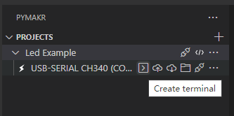
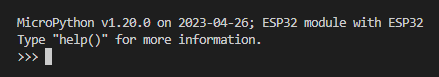

1. 准备工作

下载[micropython for esp32](https://micropython.org/download/esp32/)

vscode安装插件“Pymakr”

2. 烧写micropython

```bash
pip install esptool

esptool --chip esp32 --port your_serial_port clear_flash

esptool --chip esp32 --port your_serial_port write_flash -z 0x1000 your_micropython.bin
```

3. 在Pymakr中新建项目，选择同步目录，选择create terminal，出现micropython命令行即为配置成功



