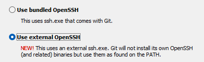

参考[Authenticated but can't fetch or push](https://github.com/orgs/community/discussions/27456)

在`git pull`的时候，明明配置好了ssh-key，但仍然报错：

```bash
git@github.com: Permission denied (publickey).
fatal: Could not read from remote repository.

Please make sure you have the correct access rights
and the repository exists.
```

首先使用`ssh -vT git@github.com`验证ssh和public key是不是正常的，如果返回内容中有：

```bash
Hi YourUserName! You've successfully authenticated, but GitHub does not provide shell access.
```

这样的内容，那说明ssh和public key配置没有问题。

可能导致这样问题的原因可能是git使用的内嵌ssh，而这个内嵌的ssh找不到我们配置的rsa密钥。

解决办法就是先卸载git，然后重新安装时注意选择`Use External OpenSSH`!

