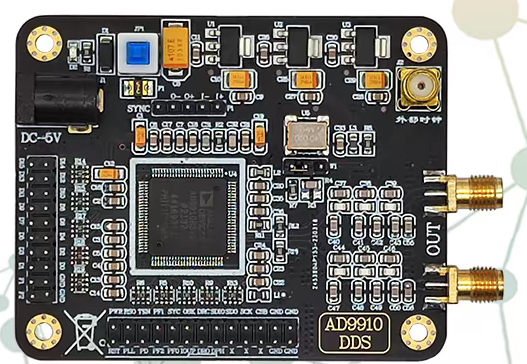
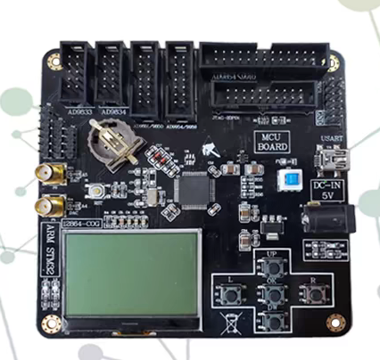
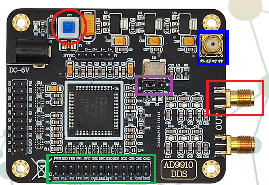
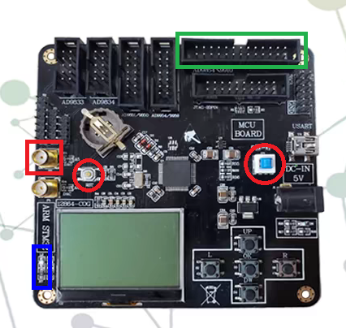

## 概述

AOM的驱动信号及扫频控制信号由AD9910及其控制板提供，本文档旨在对硬件连接、软件使用作出基本说明。



后面称为“核心板”



后面称为“控制板”

## 硬件说明

### 核心板



1. 外部连接

    - 通过左侧`DC-5V`连接到台式电源，提供5V供电

    - 通过W1跳线帽（紫色方框）进行时钟源选择，跳线帽短接左侧两个引脚时为晶振提供时钟（推荐），短接右侧两个引脚时为外部时钟源（蓝色方框）

    - DDS输出为靠近核心板中间的SMA接头（红色方框）

    - 通过下方排针与控制板连接（绿色方框）

2. 注意事项

    - （重要）DDS输出含有约1.5V的直流成分， **！！！必须！！！** 连接隔直器后再接入后级设备

    - （重要）外部时钟源输入时，输入频率 **！！！必须 ！！！** 为40MHz，推荐信号幅值为0~3V，推荐信号类型为方波

    - （重要）**注意与控制板的排线连接方向！！！没有防呆设计！！！连接错误可能直接烧掉芯片**，默认已经连接好

    - （推荐）上电前将模块开关（红色圆框）置于关闭状态

    - （不推荐）核心板出现输出异常时，直接通过开关断电重启核心板，这种硬件重置的方式只有在软件重置无效时才使用


### 控制板



1. 外部连接

    - 通过右侧USB接口连接到上位机，上位机同时可以为模块提供5V供电，使用串口与上位机通信

    - 通过左侧SMA接头（红色方框）与1pps时钟源连接

    - 通过W1跳线帽（紫色方框）进行时钟源选择，跳线帽短接左侧两个引脚时为晶振提供时钟（推荐），短接右侧两个引脚时为外部时钟源（蓝色方框）

    - 通过右上排针与核心板连接（绿色方框）

2. 注意事项
    
    - （重要）外部1pps时钟输入幅值**必须**大于1.8V（$V_{peak-to-peak}$)，为了避免意外噪声导致意外触发，建议输入幅值大于2V，蓝色方框处的蓝色LED灯在每次触发信号到来时会切换开关状态，作为时钟信号是否正常给到控制板的依据

    - （重要）注意与控制板的排线连接方向，**有防呆设计，不要硬插**，默认已经连接好

    - （推荐）直接使用USB接口为模块供电，如果使用USB-HUB，需要注意HUB连接设备过多时，将USB-HUB连接上额外供电，`DC-5V`供电接口只在供电无法满足时才需要连接

    - （推荐）上电前将模块开关（右侧红色圆框）置于关闭状态
    
    - （推荐）核心板出现输出异常时，可以通过开关（左右侧红色圆框均可）断电重启控制板，达到软件重置核心板的效果

    - （不重要）核心板的`DC-5V`不要与控制板的`DC-5V`使用同一电源供电，以减小对DDS输出噪声的影响

### 启动顺序

1. 按照外部连接说明连接核心板和控制板，检查模块开关均处于关闭状态（板卡上无红灯亮起）

2. 打开台式电源供电开关

3. 打开DDS模块开关（板上红灯亮起）

4. 打开控制板模块开关（板上红灯亮起）

## 软件配置


### 相关文件

服务端：[server_web.py](/files/AD9910/server_web.py)

服务端依赖：[requirements.txt](/files/AD9910/requirements.txt)

客户端调用示例：[client_web.py](/files/AD9910/client_web.py)

### 使用说明

1. 下载依赖`requirements.txt`并使用pip安装依赖

2. （重要）程序运行前必须先确认已经正确连接控制板

3. 运行服务端程序`server_web.py`，程序运行后会自动选择第一个设备描述中含有`STM`的串口进行连接通信

3. 编写并运行客户端程序

### 软件接口

`server_web.py`成功运行后，控制台会输出如下内容，表明服务端已经成功连接上控制板端口，并在`http://127.0.0.1:56789`监听客户端请求：

```bash
INFO:     Started server process [xxxxx]
INFO:     Waiting for application startup.
INFO:     Application startup complete.
INFO:     Uvicorn running on http://127.0.0.1:56789 (Press CTRL+C to quit)
```

`client_web.py`中包含了所有接口的调用样例代码，以下是服务端的接口说明：


|功能|请求路径|请求类型|请求体内容|成功调用返回值|备注|
|-|-|-|-|-|-|
|测试指令|`/test/`|GET|无|`{"res": 1}`||
|清空1pps序列|`/ctr/`|POST|`{"text": "SYS:TIME:CLR"}`|`{"res": "SYS:TIME:CLR"}`||
|清空1pps序列|`/ctr/`|POST|`{"text": "SYS:TIME:GET?"}`|序列长度不足10时：<br/>`{"error": "now queue size n"}`<br/>序列长度足够时：<br/>`["2024-01-23 01:23:45.123456", ...]`|序列长度不同时，返回类型不同|
|扫频一级触发|`/ctr/`|POST|`{"text": "SYS:CURVE:START"}`|`{"res": "SYS:CURVE:START"}`||
|结束扫频|`/ctr/`|POST|`{"text": "SYS:CURVE:STOP"}`|`{"res": "SYS:CURVE:STOP"}`|不会立即停止，会在扫完当前6MHz范围后不再进行下一段扫频|
|软件重置AD9910|`/ctr/`|POST|`{"text": "SYS:RESET"}`|`{"res": "SYS:RESET"}`||

**备注：**

1. 请求路径为`/test/`表示该请求的实际请求地址为`http://127.0.0.1:56789/test/`

2. 请求类型为`POST`的请求体需要用`json.dumps`编码

3. 所有调用因为网络原因不成功的，均可以用`response.status_code != 200`判断

4. （强烈建议）使用`client_web.py`封装好的接口进行接口调用

5. （建议）使用虚拟环境运行代码，参考[python虚拟环境配置](/blogs/note/python/2024-07-31.md)