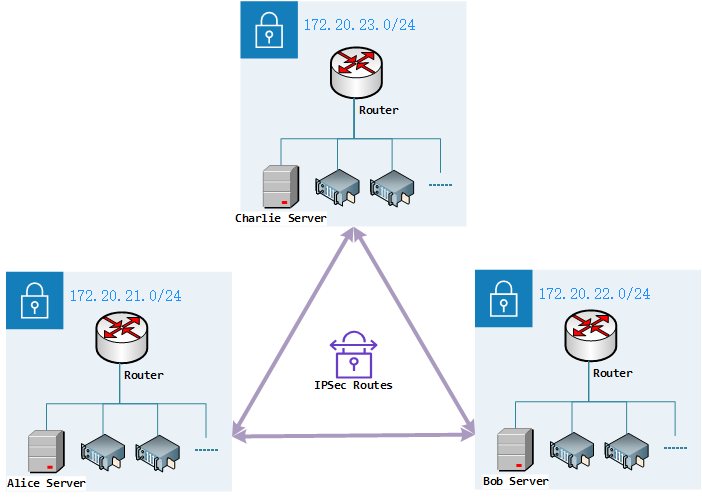

## 概述

本网络配置文档旨在详细描述 Alice、Bob 和 Charlie 子网的配置，包括子网地址分配、IPSec 隧道配置以及虚拟服务器配置。通过这些配置，可以确保各子网之间的安全通信，并且允许外部网络访问内部网络中的特定服务。系统网络拓扑图如下：

## 子网配置

在本网络配置中，我们将 Alice、Bob 和 Charlie 分配了固定的 IP 地址，以便于外部网络访问需要暴露的特定服务。每个子网都通过 TP-LINK 路由器 `TL-R479G+` 进行管理，并且各自分配了独立的子网地址。这样可以确保各端网络数据的独立性，并通过 IPSec 隧道实现子网之间的互联。具体的路由器及 LAN 接口子网地址分配如下：

|       | WAN              | LAN              |
| ----- | ---------------- | ---------------- |
| Alice | `172.20.9.21/22` | `172.20.21.0/24` |
| Bob   | `172.20.9.22/22` | `172.20.22.0/24` |
| Alice | `172.20.9.23/22` | `172.20.23.0/24` |

## IPSec 配置

IPSec（Internet Protocol Security）是一套用于在 IP 层提供安全通信的协议套件。它通过加密和认证机制，确保数据在传输过程中的机密性、完整性和真实性。IPSec 常用于建立虚拟专用网络（VPN），以便在不安全的网络（如互联网）上安全地传输数据。IPSec 的优势包括：

-   **数据加密**：确保数据在传输过程中不会被窃取或篡改。
-   **数据完整性**：通过校验机制，确保数据在传输过程中未被修改。
-   **身份认证**：确保通信双方的身份是可信的。

在本网络配置中，我们使用 IPSec 隧道来实现各子网之间的互联。通过 IPSec 隧道，Alice、Bob 和 Charlie 的子网可以安全地进行数据交换。具体的 IPSec 配置如下：

|       | IPSec                                                                                       |
| ----- | ------------------------------------------------------------------------------------------- |
| Alice | `172.20.22.0/24 via 172.20.9.22 dev ipsec0` `172.20.23.0/24 via 172.20.9.23 dev ipsec1` |
| Bob   | `172.20.21.0/24 via 172.20.9.21 dev ipsec0` `172.20.23.0/24 via 172.20.9.23 dev ipsec1` |
| Alice | `172.20.21.0/24 via 172.20.9.21 dev ipsec0` `172.20.22.0/24 via 172.20.9.22 dev ipsec1` |

## 虚拟服务器配置

虚拟服务器（Virtual Server）是一种网络配置，用于将外部网络的请求转发到内部网络中的特定服务器或设备。通过配置虚拟服务器，可以使外部用户访问内部网络中的服务。

在本网络配置中，我们为 Alice、Bob 和 Charlie 的子网配置了虚拟服务器，以便于外部网络使用 Windows Remote Desktop 或 RealVNC 远程访问控制电脑。具体的虚拟服务器配置如下：

|         | 虚拟服务器                                                  |
| ------- | ----------------------------------------------------------- |
| Alice   | `50000 -> 172.20.21.2:3389` `50000 -> 172.20.21.2:5900` |
| Bob     | `50000 -> 172.20.22.2:3389` `50000 -> 172.20.22.2:5900` |
| Charlie | `50000 -> 172.20.23.2:3389` `50000 -> 172.20.23.2:5900` |
